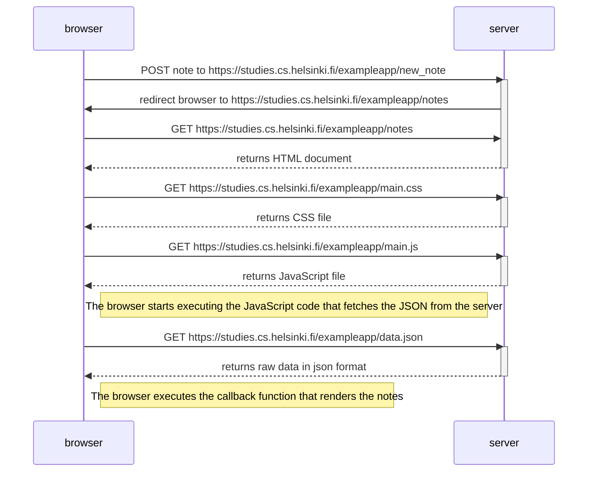

# Exercise 0.4
Sequence Diagram of User creating a new note

```mermaid
sequenceDiagram;
    participant browser;
    participant server;

    browser->>server: POST note to https://studies.cs.helsinki.fi/exampleapp/new_note;
    activate server;
    server->>browser: redirect browser to https://studies.cs.helsinki.fi/exampleapp/notes;

    browser->>server: GET https://studies.cs.helsinki.fi/exampleapp/notes;
    server-->>browser: returns HTML document;
    deactivate server;

    browser->>server: GET https://studies.cs.helsinki.fi/exampleapp/main.css;
    activate server;
    server-->>browser: returns CSS file;
    deactivate server;

    browser->>server: GET https://studies.cs.helsinki.fi/exampleapp/main.js;
    activate server;
    server-->>browser: returns JavaScript file;
    deactivate server;

    Note right of browser: The browser starts executing the JavaScript code that fetches the JSON from the server;

    browser->>server: GET https://studies.cs.helsinki.fi/exampleapp/data.json;
    activate server;
    server-->>browser: returns raw data in json format;
    deactivate server;

    Note right of browser: The browser executes the callback function that renders the notes;
```

