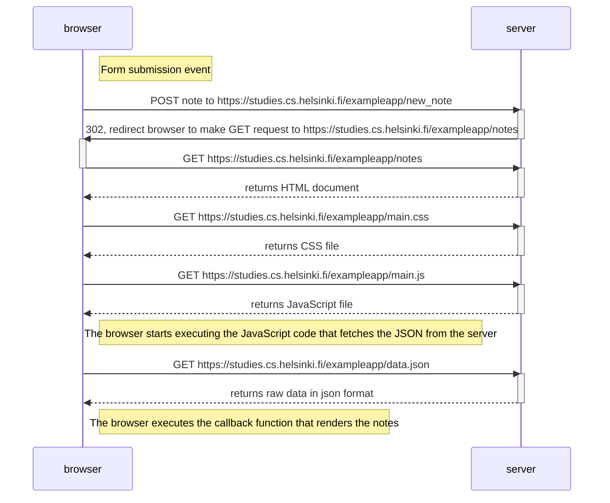
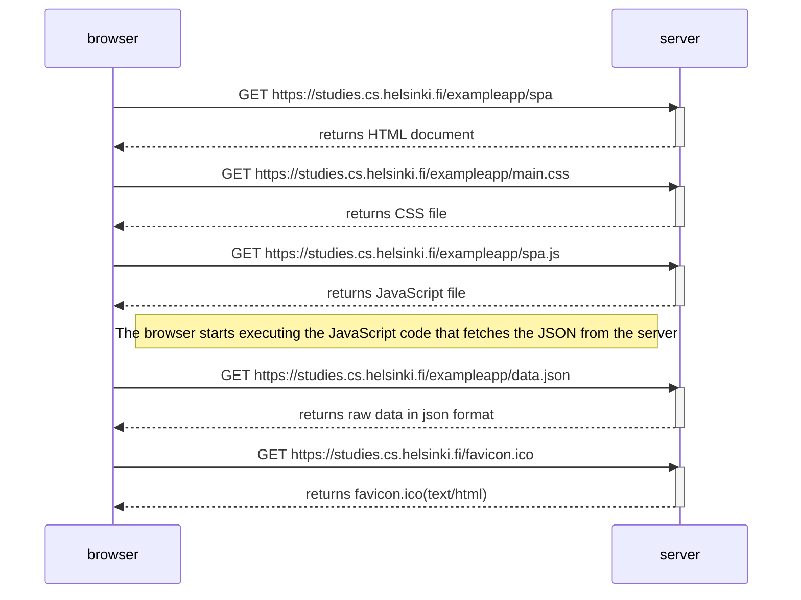
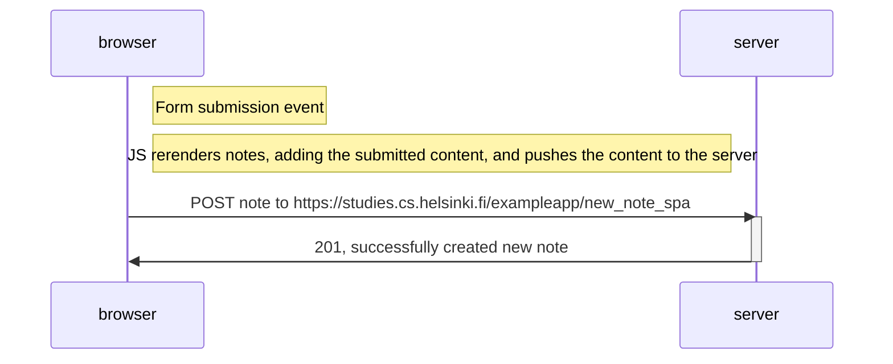

# Exercise 0.4
Sequence Diagram of User creating a new note

# Exercise 0.5
Sequence Diagram of Opening the Single Page App version

# Exercise 0.6
Sequence Diagram of creating new note on Single Page App version

